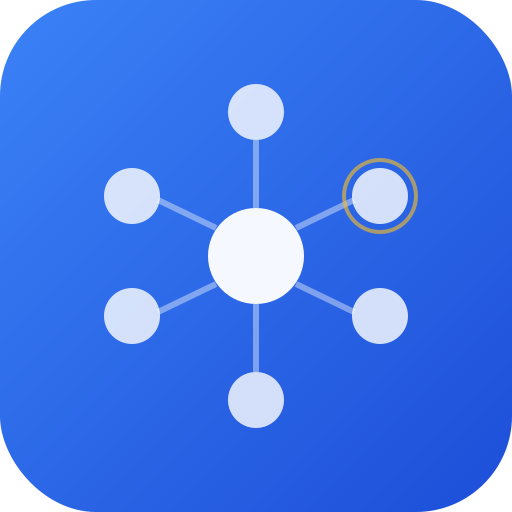

<p align="center">
  
</p>

<h1 align="center">Claude Hive</h1>

<p align="center">
  <strong>A floating dashboard that connects all your Claude Code sessions into one real-time hub.</strong>
</p>

<p align="center">
  Track session status, send messages between sessions, get desktop notifications, and navigate to any session's virtual desktop with a single click.
</p>

<p align="center">
  <a href="#installation">Installation</a> &bull;
  <a href="#how-it-works">How It Works</a> &bull;
  <a href="#features">Features</a> &bull;
  <a href="#plugin-setup">Plugin Setup</a> &bull;
  <a href="#building-from-source">Building from Source</a> &bull;
  <a href="#contributing">Contributing</a>
</p>

---

## The Problem

When running multiple Claude Code sessions across different Windows virtual desktops (or macOS Spaces / Linux workspaces), there's no way to:

- See which sessions are active, idle, or waiting for your input
- Get notified when a session needs attention while you're on a different desktop
- Send messages or instructions to a session without switching desktops
- Track what each session is currently doing at a glance

## The Solution

Claude Hive is a lightweight desktop app that sits on top of everything. Every Claude Code session automatically connects to it via MCP, reporting its status and messages in real time. You see all your sessions in one place, get notified when something needs attention, and can jump to any session's desktop with one click.

## Installation

### 1. Download the App

Download the latest release for your platform from [GitHub Releases](https://github.com/Taity180/claude-hive/releases):

| Platform | Download |
|----------|----------|
| Windows | `.msi` installer |
| macOS | Coming soon |
| Linux | Coming soon |

### 2. Install the Claude Code Plugin

In any Claude Code session, run:

```
/plugin marketplace add Taity180/claude-hive
/plugin install claude-hive@Taity180-claude-hive
```

That's it. Every new Claude Code session will automatically connect to the hub.

## How It Works

```
                    ┌──────────────────────────┐
                    │      Claude Hive App      │
                    │                           │
                    │  Floating Dashboard (UI)  │
                    │  HTTP + WebSocket Server  │
                    │  Session Registry         │
                    │  Notification Engine      │
                    └────────┬─────────────────┘
                             │ localhost:9400
              ┌──────────────┼──────────────┐
              │              │              │
         ┌────┴───┐    ┌────┴───┐    ┌────┴───┐
         │ Claude  │    │ Claude  │    │ Claude  │
         │ Code    │    │ Code    │    │ Code    │
         │Session 1│    │Session 2│    │Session 3│
         │(Desktop)│    │(Desktop)│    │(Desktop)│
         └─────────┘    └─────────┘    └─────────┘
```

1. **Claude Hive** runs a local server on port 9400
2. Each **Claude Code session** connects via MCP (Model Context Protocol) using the plugin
3. Sessions report their status and send messages through 5 MCP tools
4. The **floating dashboard** shows everything in real time via WebSocket
5. **Desktop notifications** fire when sessions need your attention
6. The **tray icon** shows a red badge with the count of sessions needing input

## Features

### Real-Time Session Tracking

Every connected Claude Code session appears in the dashboard with a color-coded status:

| Color | Status | Meaning |
|-------|--------|---------|
| Green | Running | Actively working |
| Yellow (pulsing) | Waiting | Needs your input |
| Blue | Thinking | Processing / reasoning |
| Red | Error | Something went wrong |
| Grey | Idle | Done or disconnected |

### Floating Overlay

- **Always-on-top** window that follows across virtual desktops
- **Custom frameless design** with drag-to-move
- **Auto-resizes** based on content — grows with sessions, shrinks when they disconnect
- **Collapsed mode** shows just session pills; expand for full detail
- **Minimize to tray** — always accessible from the system tray

### Chat Messaging

- **Session to Hub**: Claude reports progress, asks questions, flags errors
- **You to Session**: Reply to any session directly from the dashboard
- **Broadcast**: Send a message to all sessions at once
- **Cross-session**: Sessions can broadcast to coordinate with each other

### Desktop Navigation

Click **"Go to"** on any session to instantly:
- Switch to the Windows virtual desktop where that terminal lives
- Focus the terminal window

Works on:
- **Windows 11**: Full virtual desktop switching via `winvd`
- **macOS**: Activates the terminal process (auto-switches to its Space)
- **Linux (X11)**: `xdotool` / `wmctrl` workspace switching

### Tray Icon Badge

The system tray icon shows a red badge with the count of sessions needing your attention. Clears automatically when all sessions are running smoothly.

### Desktop Notifications

Native desktop notifications fire when:
- A session changes to "waiting for input"
- A session encounters an error
- A new session connects
- A session sends a priority notification

### 10 Built-in Themes

Choose from 10 dark themes that match your setup:

1. **Frosted Glass** (default) — semi-transparent with backdrop blur
2. **Warm Neutral** — warm greys, amber accent
3. **Cool Slate** — blue-grey, teal accent
4. **Minimal Carbon** — near-black, green accent
5. **Nord** — polar night, frost blue accent
6. **Solarized Dark** — classic solarized, yellow accent
7. **Dracula** — dark purple-grey, pink accent
8. **Monokai** — dark brown-black, orange accent
9. **Catppuccin Mocha** — soft dark, lavender accent
10. **Rose Pine** — muted dark, rose accent

### LAN Access

Access the dashboard from any device on your local network at `http://192.168.x.x:9400`. Monitor your sessions from your phone or tablet.

## MCP Tools

When connected, Claude Code gets 5 tools it uses proactively:

| Tool | Purpose |
|------|---------|
| `hub_send_message` | Report progress, ask questions, flag completions/errors |
| `hub_set_status` | Update the session's status indicator on the dashboard |
| `hub_get_messages` | Check for messages you sent from the dashboard |
| `hub_notify` | Trigger a desktop notification for important events |
| `hub_broadcast` | Send a message to all other connected sessions |

The plugin's session-start hook instructs Claude to use these tools proactively — no manual prompting needed.

## Plugin Setup

The Claude Code plugin handles everything automatically:

- **MCP server config** — registers the `claude-hive mcp` process
- **Session-start hook** — checks hub connectivity and injects behavioral instructions
- **Skill** — provides setup guidance and usage reference

### Manual Configuration

If you prefer not to use the plugin, add this to your `~/.claude/settings.json`:

```json
{
  "mcpServers": {
    "claude-hive": {
      "command": "claude-hive",
      "args": ["mcp"]
    }
  }
}
```

## Configuration

| Environment Variable | Default | Description |
|---------------------|---------|-------------|
| `CLAUDE_HIVE_PORT` | `9400` | Port for the HTTP/WebSocket server |

The server binds to `0.0.0.0` by default (accessible on localhost and LAN).

## Architecture

### Tech Stack

| Component | Technology |
|-----------|-----------|
| Desktop App | Tauri v2 (Rust backend + WebView) |
| HTTP/WS Server | Axum + tokio |
| Frontend | React 18 + TypeScript + Vite |
| Styling | Tailwind CSS v4 |
| State Management | Zustand |
| MCP Server | Custom Rust stdio handler |
| Desktop Integration | Windows: winvd, macOS: osascript, Linux: xdotool |
| Notifications | Tauri notification plugin |
| CI/CD | GitHub Actions (cross-platform) |

### Project Structure

```
claude-hive/
├── src-tauri/               # Rust backend
│   ├── src/
│   │   ├── main.rs          # Entry point
│   │   ├── lib.rs           # Tauri app + CLI + commands
│   │   ├── server/          # Axum HTTP + WebSocket server
│   │   ├── mcp/             # MCP stdio server (5 tools)
│   │   ├── models/          # Session, Message, Event types
│   │   ├── state/           # In-memory session registry + message store
│   │   ├── desktop/         # Virtual desktop navigation (Win/Mac/Linux)
│   │   └── tray_badge.rs    # Dynamic tray icon badge generation
│   ├── tests/               # Integration tests
│   └── Cargo.toml
├── src/                     # React frontend
│   ├── App.tsx              # Main app + WindowBar
│   ├── api.ts               # API URL configuration
│   ├── components/          # UI components
│   ├── hooks/               # WebSocket, theme hooks
│   ├── stores/              # Zustand state management
│   ├── themes/              # 10 theme definitions
│   └── types/               # TypeScript types
├── .claude-plugin/          # Plugin metadata (marketplace + plugin.json)
├── .mcp.json                # MCP server configuration
├── hooks/                   # Session-start hook
├── skills/                  # Behavioral skill
└── .github/workflows/       # CI/CD
```

## Building from Source

### Prerequisites

- [Rust](https://rustup.rs/) (latest stable)
- [Node.js](https://nodejs.org/) (v22+)
- [pnpm](https://pnpm.io/) (v9+)
- **Linux only**: `libwebkit2gtk-4.1-dev libappindicator3-dev librsvg2-dev`

### Development

```bash
# Clone the repo
git clone https://github.com/Taity180/claude-hive.git
cd claude-hive

# Install dependencies
pnpm install

# Start in dev mode (hot-reload)
pnpm tauri dev
```

### Production Build

```bash
pnpm tauri build
```

Output is in `src-tauri/target/release/bundle/`.

### Running Tests

```bash
# Frontend tests
pnpm test

# Rust tests
cd src-tauri && cargo test
```

## API Reference

The HTTP API is available at `http://localhost:9400` for custom integrations.

### Endpoints

| Method | Path | Description |
|--------|------|-------------|
| `GET` | `/api/health` | Health check |
| `GET` | `/api/sessions` | List all sessions |
| `POST` | `/api/sessions` | Register a session |
| `DELETE` | `/api/sessions/:id` | Unregister a session |
| `PUT` | `/api/sessions/:id/status` | Update session status |
| `POST` | `/api/sessions/:id/messages` | Send message from session |
| `GET` | `/api/sessions/:id/messages` | Get all messages for session |
| `POST` | `/api/sessions/:id/messages/user` | Send message from user |
| `POST` | `/api/sessions/:id/messages/query` | Query messages with filters |
| `POST` | `/api/sessions/:id/broadcast` | Broadcast to all other sessions |
| `POST` | `/api/sessions/:id/notify` | Trigger desktop notification |
| `WS` | `/ws` | WebSocket for real-time events |

## Contributing

Contributions are welcome! Please:

1. Fork the repository
2. Create a feature branch (`git checkout -b feature/amazing-feature`)
3. Commit your changes (`git commit -m 'feat: add amazing feature'`)
4. Push to the branch (`git push origin feature/amazing-feature`)
5. Open a Pull Request

### Areas for Contribution

- Additional themes
- Mobile-responsive LAN dashboard
- Session persistence across app restarts
- Message search and history
- Session grouping / tagging
- Wayland support for Linux desktop navigation

## License

MIT

## Acknowledgments

Built with [Tauri](https://tauri.app/), [React](https://react.dev/), [Axum](https://github.com/tokio-rs/axum), and [Claude Code](https://claude.ai/code).
